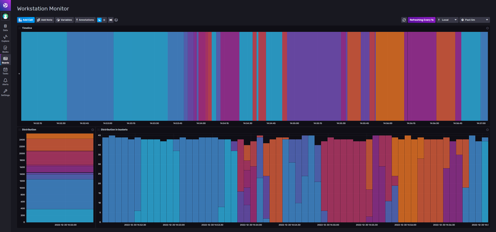
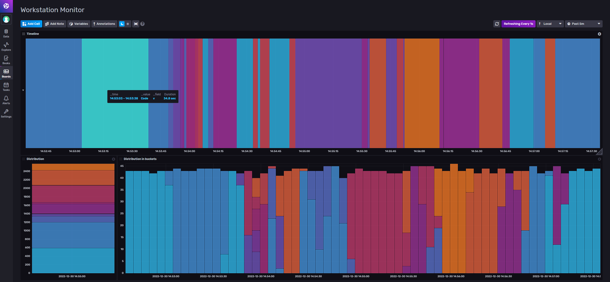
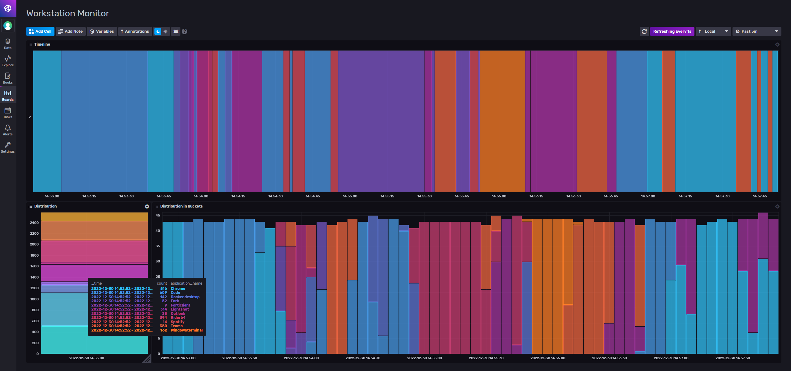

# Workstation Monitor

This project is created to monitor your applications throughout a certain period of time.  
The motivation came from me wanting to know in which applications I spend the biggest chunks of my day.  
I was mainly wondering how much time I actually spend in my IDE vs Teams vs Chrome vs Some hidden time consuming application?

Getting these insights was really valuable. I can now really see during which parts of the day I get most programming work done compared to meetings etc. It can all run locally with Docker and .NET 6 so I really recommend trying it out for a couple of days / weeks to see where you spend your time.

It is built on windows with a convenient PowerShell script in the `infra` folder for starting up quickly and easily.

For data storage and visualisation I chose for InfluxDB. It is the best choice for timeseries and comes with great visualisation tools out of the box. 

